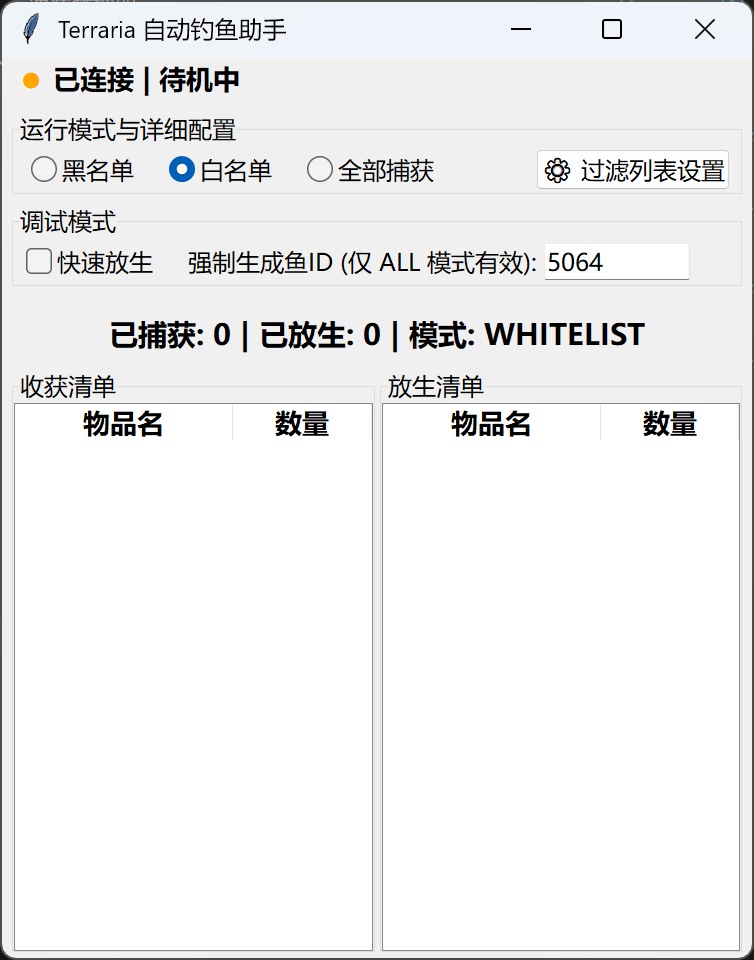
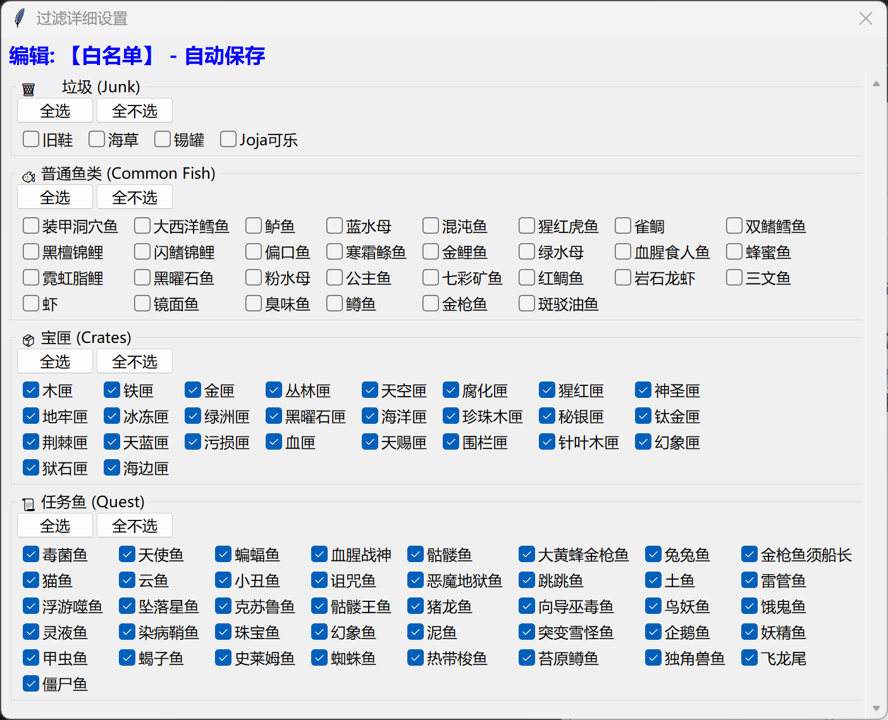

# Terraria 自动化钓鱼助手

**简体中文** | [English](./README.md)

基于内存特征码定位的 Terraria 自动化钓鱼助手。具备智能过滤、实时统计及现代化图形操作界面。

---

## ✨ 功能亮点

* **智能过滤模式**: 
    * **白名单**: 只钓取你选中的特定物品。
    * **黑名单**: 自动跳过指定的垃圾或鱼类。
    * **全部捕获**: 记录并收纳每一次上钩的物品。
* **增强型过滤窗口**:
    * 物品按 **垃圾、普通鱼、宝匣、任务鱼** 严谨分类。
    * 每类新增 **全选/全不选** 按钮，支持秒级配置。
* **动态 UI 交互**: 
    * 切换至“全部捕获”模式时，过滤设置按钮将自动 **禁用**，避免逻辑冲突。
* **自动持久化**: 所有配置实时保存至 `config.ini`。
* **强力内存扫描**: 采用动态模式匹配技术定位游戏指针，无需维护硬编码地址，兼容性更强。

---

## 🚀 使用方法

> [!IMPORTANT]
> 程序会在抛竿后自动启动。请保持光标位置不变，程序会模拟鼠标点击。

### GUI 图形界面模式 (推荐)
```sh
uv run main.py
```

### 控制台模式 (纯逻辑)
```sh
uv run main_console.py
```

**注意:** 控制台模式是独立的，**不会**读取 `config.ini`。请直接修改源代码中的变量来设置过滤列表和模式。

---

## 📸 界面展示

| 主控制面板 | 详细过滤设置 |
| --- | --- |
|  |  |

---

## 🛠️ 环境要求

* **游戏版本**: 已在 **Terraria 1.4.5.3** (单人模式及独立服务器) 测试通过。
* **开发环境**: Python 3.13+ (建议使用 `uv` 管理依赖)。

---

## ⚙️ 配置文件说明

程序在首次运行时会生成 `config.ini` 文件。你可以直接在 GUI 界面进行修改，也可以手动编辑该配置文件。